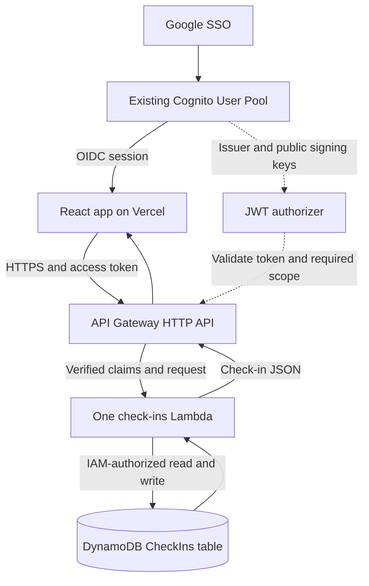

# Check-in persistence proposal

Status: proposed persistence contract. A local [CDK infrastructure scaffold](../infra/README.md) now defines the table and authenticated API, and its Lambda implements `GET /checkins` and `PUT /checkins/{date}` (clear-all is not implemented yet). Web synchronization is not implemented yet.

## Recommendation

Use the existing Cognito sign-in with an API Gateway HTTP API, one Lambda function, and one DynamoDB table in `eu-central-1`. Keep the web app on Vercel. Save only check-ins; Cognito already owns user identity, and summaries can continue to be calculated in the browser.

This is a good fit for the actual access pattern: one person's small records, read in date order, with one record per day. Use DynamoDB on-demand capacity initially. No users table, feelings table, secondary index, AppSync, Cognito Identity Pool, or background synchronization worker is needed.

The current repository contains a Cognito auth template, not an existing DynamoDB integration to copy. This design reuses its identity setup, not a presumed database setup.

## Current behavior

- [`CheckIn`](../web/src/domain/checkins.ts) contains `date` and `values`. Saving the same date replaces the previous check-in.
- [`Values`](../web/src/domain/feelings.ts) is a map of seven stable feeling IDs to integer intensities: **0, 1, 2, 3, 4**, not 0 through 5. Zero means not felt; four means intense.
- [`storage.ts`](../web/src/storage.ts) stores the whole list locally under an account-specific key. There is no cloud persistence or cross-device synchronization.
- [`App.tsx`](../web/src/App.tsx) currently confirms a save immediately and also offers sample data and clearing the list. That synchronous behavior must change when writes become remote.

## Architecture



The browser never talks directly to DynamoDB and never receives AWS credentials. Login tokens identify the person; the Lambda execution role grants database access.

## Table and record

Suggested table name: `energy-me-checkins-prod`, with a separate table for development.

| Attribute       | Type                  | Purpose                                                          |
| --------------- | --------------------- | ---------------------------------------------------------------- |
| `userId`        | String, partition key | Cognito `sub`, supplied by the server from verified claims       |
| `date`          | String, sort key      | Local calendar date, `YYYY-MM-DD`; one check-in per user per day |
| `values`        | Map of numbers        | Seven stable English feeling keys, each an integer from 0 to 4   |
| `createdAt`     | String                | UTC ISO timestamp set by the API on first creation               |
| `updatedAt`     | String                | UTC ISO timestamp set by the API on each successful write        |
| `schemaVersion` | Number                | Record format version; initially `1`                             |

Example document, using normal JSON rather than DynamoDB's low-level `S`/`N`/`M` encoding:

```json
{
  "userId": "example-cognito-sub",
  "date": "2026-10-07",
  "values": {
    "anger": 0,
    "frustration": 1,
    "worry": 2,
    "joy": 3,
    "sadness": 0,
    "guilt": 1,
    "fear": 0
  },
  "createdAt": "2026-10-07T15:00:00.000Z",
  "updatedAt": "2026-10-07T15:00:00.000Z",
  "schemaVersion": 1
}
```

The combination of `userId` and `date` is already a unique ID. Do not add a random check-in ID or use `createdAt` as the sort key: doing so would allow multiple records for the same day and change the product's current behavior.

**DynamoDB does not generate IDs, creation timestamps, update timestamps, or enforce the feeling schema.** Our API must do that. Only the two key attributes are defined in the table's key schema; non-key attributes are stored on each item.

The date is the date chosen by the client in the user's local timezone. Timestamps describe when the server received the write, in UTC. Do not derive the check-in date from the server's UTC clock: near midnight it can be a different day. A timezone attribute is unnecessary for the current per-date summaries; add one only if the product later needs timezone history.

## English persistence keys

Use English keys in every API request, API response, and DynamoDB record. These are canonical schema identifiers, independent of the language displayed in the UI.

| API / DynamoDB key | Current app / local-storage ID |
| ------------------ | ------------------------------ |
| `anger`            | `raiva`                        |
| `frustration`      | `frustracao`                   |
| `worry`            | `preocupacao`                  |
| `joy`              | `alegria`                      |
| `sadness`          | `tristeza`                     |
| `guilt`            | `culpa`                        |
| `fear`             | `medo`                         |

The future web repository adapter must convert the current Portuguese IDs to English before sending a request, and convert English response keys back to the current domain IDs on reads. This keeps the existing charts, Portuguese labels, and local records compatible without renaming the running app's domain model as part of this proposal. Local-data imports must use the same mapping.

The backend accepts only the seven English keys, not a mixture of languages or translated display labels. Preserve each intensity exactly during conversion. No cloud schema version bump is needed: the persistence schema has not been implemented yet, so English keys are the proposed `schemaVersion: 1` format.

## Map versus ordered array

Prefer a named map with the English persistence keys. An array such as `[0, 1, 2, 3, 0, 1, 0]` is smaller, but its meaning depends on a shared, immutable order:

`anger, frustration, worry, joy, sadness, guilt, fear`

Reordering or inserting a feeling could silently reinterpret historical records. The existing charts and domain functions already consume a named map; translating stable keys at the repository boundary is explicit and does not depend on array positions.

Seven short keys are not a meaningful optimization target at this scale. DynamoDB charges reads and writes in size units, not per JSON key; measure item sizes before optimizing. If an array is adopted later, make `schemaVersion` mandatory and keep a fixed mapping for every historical version. Do not persist translated labels or array positions as feeling identity.

## API contract

All routes require `Authorization: Bearer <Cognito access token>`. The client never supplies `userId`, server timestamps, or schema version in write requests.

### Save or update a day

`PUT /checkins/2026-10-07`

```json
{
  "values": {
    "anger": 0,
    "frustration": 1,
    "worry": 2,
    "joy": 3,
    "sadness": 0,
    "guilt": 1,
    "fear": 0
  }
}
```

Validate an actual calendar date, not just a matching regular expression. Accept exactly the seven English keys defined above, each an integer from 0 to 4; reject missing keys, Portuguese or other unknown keys, fractions, strings, nulls, and out-of-range values. Keep the UI's requirement that at least one intensity is positive, and enforce it on the API as well. Limit body size to a small bound, for example 4 KB.

Use `UpdateItem` with a fixed update expression that sets `values`, `updatedAt`, and `schemaVersion`, and sets `createdAt` with `if_not_exists`. Use `@aws-sdk/lib-dynamodb` to marshal the document and `ReturnValues: ALL_NEW` to return the canonical saved item with `200 OK`.

Repeated PUTs to the same user/date do not create duplicates. They can advance `updatedAt`. Initial conflict policy: **last successful server write wins**. This is not the same as the latest offline edit winning; do not implement automatic background retries of old edits in v1. Add revision-based conditional writes if simultaneous editing becomes a real requirement.

### Read history

`GET /checkins?from=2026-08-01&to=2026-10-07&limit=100`

`from` and `to` are optional, validated inclusive dates. If omitted, read the user's history. Reject reversed bounds. `limit` defaults to 100 and has a hard maximum of 100 items per page.

Use DynamoDB `Query` with equality on the authenticated `userId` partition and a sort-key date condition when bounds are present. Do not use `Scan` or a filter to isolate users. Ascending ISO date keys match the app's expected chronological order. Use strongly consistent table reads initially to avoid a just-saved check-in appearing absent on a different request.

```json
{
  "items": [],
  "nextCursor": null
}
```

A non-null cursor represents DynamoDB's `LastEvaluatedKey`; DynamoDB can paginate before the requested limit because of its 1 MB response limit. Validate cursor structure, require its `userId` to equal the verified user's `sub`, and keep the same bounds across pages. A base64-encoded JSON cursor is an encoding, not an authorization mechanism or a secret.

The web app should fetch every page needed for its summaries before calculating them. For v1, fetch the full paginated history and adapt returned items to the existing `{ date, values }` domain shape, translating English persistence keys back to the current app IDs. Do not treat a partial page as a complete historical record or show an empty state when a request failed.

### Existing clear-all control

`DELETE /checkins`

This route clears only the authenticated user's records after explicit UI confirmation. Query that user's keys, delete in batches of at most 25 items, and retry DynamoDB `UnprocessedItems` with bounded exponential backoff and jitter. Return `204 No Content` only when all enumerated records have been deleted.

This is not a transaction or an account deletion. Another device can create a new check-in while deletion runs. Define the operation as deleting the records enumerated during this request; disable writes in the initiating UI while it runs. If retries or the request deadline are exhausted, return a retryable error and reload history: partial deletion is possible. Keep the user's account intact. This tradeoff is acceptable for the initial small history, but a large-history deletion job is a later concern.

For a strictly save/read-only first release, omit this route and hide the clear-all action. Do not leave it clearing only the local cache while remote records remain.

### Errors

Use `400` for invalid input, `401` for invalid/expired authentication, `403` for disallowed token type or permissions, and `429`/`503` for retryable failures. Return a small JSON error with a stable code and a request ID, not raw AWS errors or token contents. A failed write must not produce a saved toast.

## Authentication and permissions

1. Configure API Gateway's JWT authorizer with the existing Cognito issuer and app client ID as its audience. For Cognito access tokens without an `aud` claim, API Gateway uses `client_id`. Require the existing `openid` scope on every data route so an ID token without scopes cannot authorize it.
2. In Lambda, require verified `sub` and `token_use: access` from the authorizer context. Never decode a caller's JWT and treat the unverified payload as proof of identity. Never accept ownership from a URL, request body, or cursor.
3. Restrict the Lambda role to `Query`, `UpdateItem`, and, if implementing clear-all, `BatchWriteItem` on this table. No wildcard table permissions. Lambda owns per-user isolation; its role can technically access every row in the table, so adversarial isolation tests are required.
4. Configure CORS for `https://energy-me.vercel.app` and an explicitly allowed development origin, with `Authorization` and `Content-Type` headers and only the required methods. Allow unauthenticated preflight handling. CORS is not authorization.
5. Add only `VITE_CHECKINS_API_URL` to the web build. The API endpoint is public configuration. Table name and AWS region belong to the backend environment; AWS permissions come from its role. Never put AWS keys or a client secret in the browser.

Later, custom resource-server scopes such as `checkins/read` and `checkins/write` can separate permissions. They are not required for this single-purpose first API. Differentiate production and development resources, and restrict which app clients each environment accepts.

## Web integration and migration

- Introduce a small asynchronous check-in repository: list history, PUT one date, and optionally clear history. Translate feeling keys in both directions at this boundary using the mapping above. The current whole-list `saveCheckIns` API should not upload the entire history on every edit.
- Obtain a valid access token through the existing auth client before each API request. On a `401`, renew once through the OIDC client when possible; retry once, then require sign-in. Do not write a second independent token store or log tokens.
- Load remote records after authentication. Abort outstanding work when signing out or changing accounts, and prevent late responses from updating another account's state.
- On save, keep the entered values available, disable duplicate submissions, await the server response, then update the list and show the saved toast. On failure, preserve the draft and show a retry action. Offline saving is not supported in v1; do not claim success for a local-only write.
- Keep a local draft/cache only as a convenience, separated by account. The cloud is authoritative. A cached view must be marked stale when remote loading fails; browser storage is neither encrypted nor a substitute for durable storage.
- Do not automatically upload existing local records. They may include sample data, which currently has the same shape as real data. Offer an explicit import preview for that signed-in account; use PUT per date, preserve remote entries on conflicts unless the user chooses replacement, and retain the source until import completes. Do not upload anonymous legacy records to an arbitrary account.
- Keep sample data in an isolated demo mode, or hide the sample-data action in the authenticated production view. Never route `onLoadSample` through the cloud-saving repository.
- Summaries, charts, feeling metadata, and existing domain types remain local computations. A future iOS client can use the same API and per-date contract.

## Is there an easier option?

| Option                          | Benefit                                                                       | Cost or limitation                                                                                                                                                                          |
| ------------------------------- | ----------------------------------------------------------------------------- | ------------------------------------------------------------------------------------------------------------------------------------------------------------------------------------------- |
| Keep localStorage               | Already implemented; no backend                                               | No durable cloud copy, device sync, or recovery after clearing browser data                                                                                                                 |
| Vercel Function + DynamoDB      | Fewer deployed services than API Gateway + Lambda; web and API in one project | Must verify Cognito access tokens server-side with a library such as `aws-jwt-verify` and configure least-privilege AWS access from Vercel, preferably through workload identity federation |
| Amplify Data + DynamoDB         | Generates GraphQL CRUD and owner-based authorization with Cognito             | Adds AppSync and Amplify infrastructure/tooling; easier generated CRUD, not necessarily a smaller system                                                                                    |
| Supabase or Firebase            | Managed client SDKs can reduce custom backend code in a greenfield app        | Introduces another platform and requires choosing or integrating its authorization model with the existing Cognito login                                                                    |
| API Gateway + Lambda + DynamoDB | Native Cognito JWT validation, no browser AWS credentials, explicit small API | Three AWS resources to provision and maintain; recommended here given the existing AWS identity setup                                                                                       |

**DynamoDB is not required just because Cognito is in use.** A Vercel Function is a reasonable simpler hosting choice if minimizing AWS service setup matters most. For an AWS-native setup without cross-provider AWS credential configuration, the recommended HTTP API/Lambda design is the more straightforward security boundary.

## Operations and implementation order

1. Review and deploy the [TypeScript CDK scaffold](../infra/README.md) in development: one on-demand table, one Node.js Lambda, the HTTP API, JWT authorizer, CORS, and IAM role. It defines these resources but does not implement read/write persistence or deploy them automatically.
2. Implement server validation and GET/PUT first, followed by clear-all if preserving that control. Do not add a VPC, secondary indexes, TTL, or analytics tables for this workload.
3. Test unauthenticated requests, wrong clients, ID-token rejection, Alice/Bob isolation, forged ownership, malformed cursors, real calendar validation, values 0/4 versus -1/5/fractions, English-only API keys, lossless round-trip conversion of local IDs, duplicate daily PUTs, preserved `createdAt`, pagination, and partial-delete failures.
4. Add the async repository and authenticated web loading/saving states. Test network failures, expired sessions, account switches during requests, and sample-data isolation. Then configure `VITE_CHECKINS_API_URL` in Vercel and deploy the web build.
5. Run acceptance checks: save on device A, read on device B with the same account, edit the same day without creating a duplicate, confirm another account cannot see it, and verify clear-all behavior if enabled.

Enable encryption at rest, point-in-time recovery, bounded log retention, API throttling, and alarms for errors before storing real emotional data. DynamoDB provides encryption at rest by default; backup, logging, and throttling settings still need deliberate configuration. Log request IDs, status, and latency, not tokens, email addresses, or feeling values. Do not expire personal history with TTL by default.

Costs include database requests/storage, HTTP API calls, Lambda execution, logs, and backups; do not promise that this is free. Small daily per-user records fit serverless usage well, but region pricing and actual traffic determine the bill.

Proposed v1 boundaries: one record per local day, integer intensities 0-4, English-keyed values map, last-successful-write-wins, no automatic offline synchronization, no silent import, and no separate users table. Approval of this proposal should precede implementing or deploying the backend.
